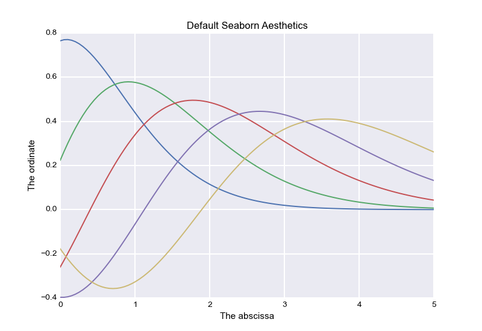

Scientific Plotting Utilities
=============================

Seaborn is a library of high-level functions that facilitate making informative
and attractive plots of statistical data (with some emphasis on neuroimaging
applications) using matplotlib.

It also provides concise control over the aesthetics of the plots, improving on
matplotlib's default look:

Examples
--------

There are a few tutorial notebooks that both offer some thoughts on visualizing
statistical data in a general sense and show how to do it using the tools that
are proided in seaborn. They also serve as the primary test suite for the package.
The notebooks are meant to be fairly, but not completely comprehensive;
hopefully the docstrings for the specific functions will answer any additional
questions.

[Visualizing distributions of data](http://nbviewer.ipython.org/urls/raw.github.com/mwaskom/seaborn/master/examples/plotting_distributions.ipynb)

[Representing variability in timeseries plots](http://nbviewer.ipython.org/urls/raw.github.com/mwaskom/seaborn/master/examples/timeseries_plots.ipynb)

[Plotting complex linear models](http://nbviewer.ipython.org/urls/raw.github.com/mwaskom/seaborn/master/examples/linear_models.ipynb)

Dependencies
------------

- Python 2.7

- [numpy](http://www.numpy.org/)

- [pandas](http://pandas.pydata.org/)

- [statsmodels](http://statsmodels.sourceforge.net/)

- [husl](https://github.com/boronine/pyhusl)

- [moss](http://github.com/mwaskom/moss)

Installation
------------

To install the released version, just do

    pip install -U seaborn

However, I update the code pretty frequently, so you may want to clone the
github repository and install with

    python setup.py install

Development
-----------

https://github.com/mwaskom/seaborn

Celebrity Endorsements
----------------------

"Those are nice plots" -Hadley Wickham
